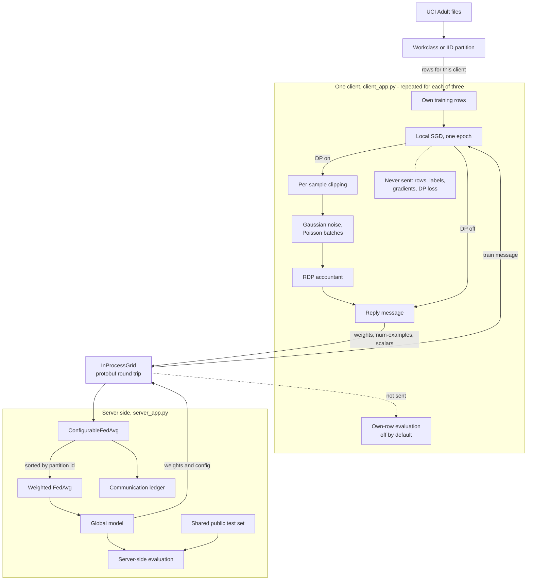

```mermaid
flowchart TB
    Adult["UCI Adult files"]
    Part["Workclass or IID partition"]

    subgraph CLIENT["One client, client_app.py - repeated for each of three"]
        Rows["Own training rows"]
        Local["Local SGD, one epoch"]
        Clip["Per-sample clipping"]
        Noise["Gaussian noise,<br/>Poisson batches"]
        Acct["RDP accountant"]
        Reply["Reply message"]
        Stay["Never sent: rows, labels,<br/>gradients, DP loss"]
        CEval["Own-row evaluation<br/>off by default"]
    end

    Grid["InProcessGrid<br/>protobuf round trip"]

    subgraph SERVER["Server side, server_app.py"]
        Strategy["ConfigurableFedAvg"]
        Agg["Weighted FedAvg"]
        GlobalM["Global model"]
        Ledger["Communication ledger"]
        EvalFn["Server-side evaluation"]
        TestSet["Shared public test set"]
    end

    Adult --> Part
    Part -->|"rows for this client"| Rows
    GlobalM -->|"weights and config"| Grid
    Grid -->|"train message"| Local
    Rows --> Local
    Local -->|"DP on"| Clip
    Clip --> Noise
    Noise --> Acct
    Acct --> Reply
    Local -->|"DP off"| Reply
    Local -.- Stay
    Grid -.->|"not sent"| CEval
    Reply -->|"weights, num-examples, scalars"| Grid
    Grid --> Strategy
    Strategy -->|"sorted by partition id"| Agg
    Agg --> GlobalM
    Strategy --> Ledger
    GlobalM --> EvalFn
    TestSet --> EvalFn
```
