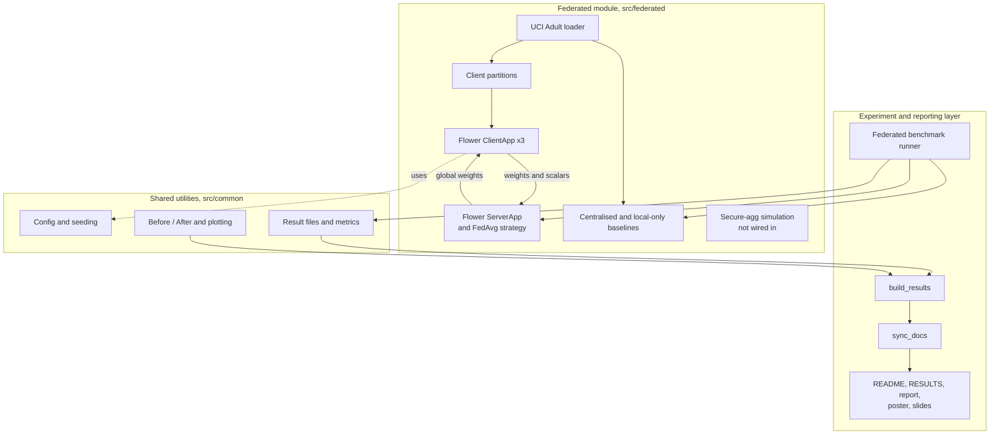

```mermaid
flowchart TB
    subgraph FED["Federated module, src/federated"]
        Adult["UCI Adult loader"]
        Part["Client partitions"]
        Clients["Flower ClientApp x3"]
        Server["Flower ServerApp<br/>and FedAvg strategy"]
        FBase["Centralised and local-only baselines"]
        SecAgg["Secure-agg simulation<br/>not wired in"]
    end

    subgraph COMMON["Shared utilities, src/common"]
        Cfg["Config and seeding"]
        IO["Result files and metrics"]
        BA["Before / After and plotting"]
    end

    subgraph EXP["Experiment and reporting layer"]
        RunF["Federated benchmark runner"]
        Build["build_results"]
        Sync["sync_docs"]
        Docs["README, RESULTS, report,<br/>poster, slides"]
    end

    Adult --> Part
    Part --> Clients
    Server -->|"global weights"| Clients
    Clients -->|"weights and scalars"| Server
    Adult --> FBase

    RunF --> Server
    RunF --> FBase
    RunF --> IO
    Clients -.->|"uses"| Cfg
    IO --> Build
    BA --> Build
    Build --> Sync
    Sync --> Docs
```
