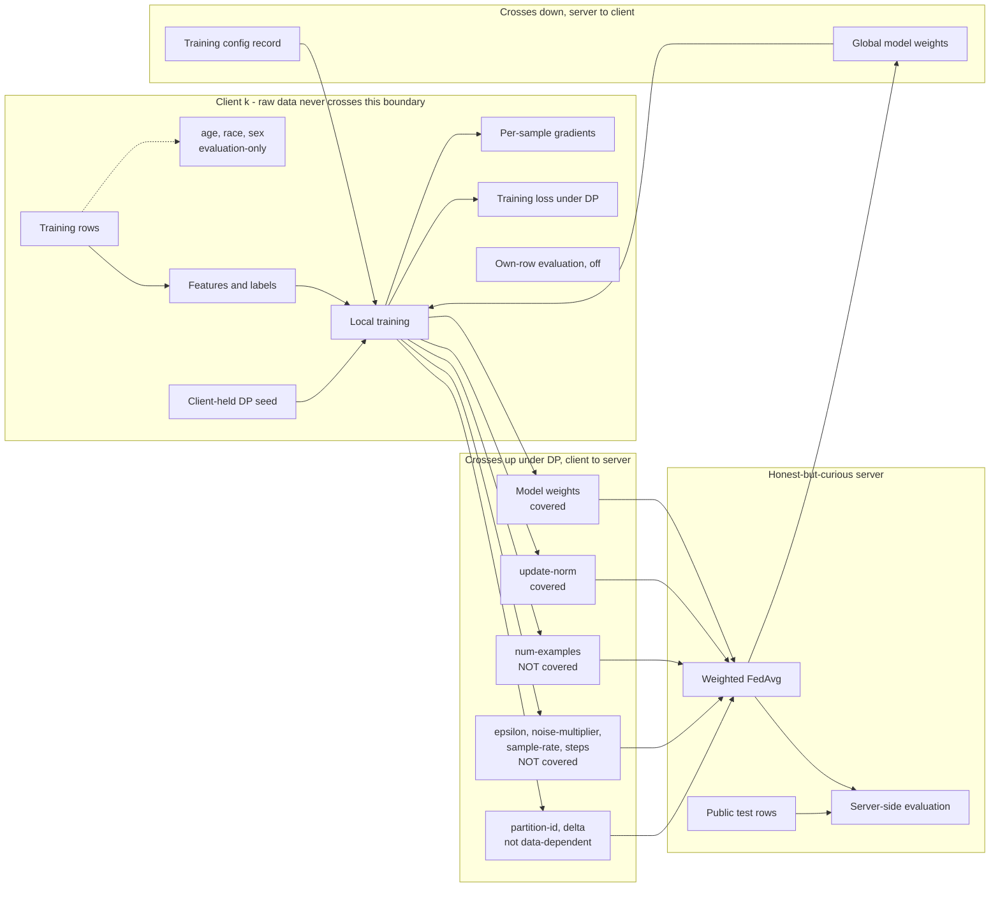

```mermaid
flowchart LR
    subgraph CLIENT["Client k - raw data never crosses this boundary"]
        Rows["Training rows"]
        Prot["age, race, sex<br/>evaluation-only"]
        XY["Features and labels"]
        PSG["Per-sample gradients"]
        Loss["Training loss under DP"]
        Secret["Client-held DP seed"]
        CEval["Own-row evaluation, off"]
        Train["Local training"]
    end

    subgraph DOWN["Crosses down, server to client"]
        DW["Global model weights"]
        DC["Training config record"]
    end

    subgraph UP["Crosses up under DP, client to server"]
        UW["Model weights<br/>covered"]
        UN["update-norm<br/>covered"]
        UNum["num-examples<br/>NOT covered"]
        UAcct["epsilon, noise-multiplier,<br/>sample-rate, steps<br/>NOT covered"]
        UPub["partition-id, delta<br/>not data-dependent"]
    end

    subgraph SERVER["Honest-but-curious server"]
        Agg["Weighted FedAvg"]
        Eval["Server-side evaluation"]
        Test["Public test rows"]
    end

    Rows --> XY
    Rows -.-> Prot
    XY --> Train
    Train --> PSG
    Train --> Loss
    Secret --> Train
    DW --> Train
    DC --> Train
    Train --> UW
    Train --> UN
    Train --> UNum
    Train --> UAcct
    Train --> UPub
    UW --> Agg
    UN --> Agg
    UNum --> Agg
    UAcct --> Agg
    UPub --> Agg
    Agg --> DW
    Agg --> Eval
    Test --> Eval
```
